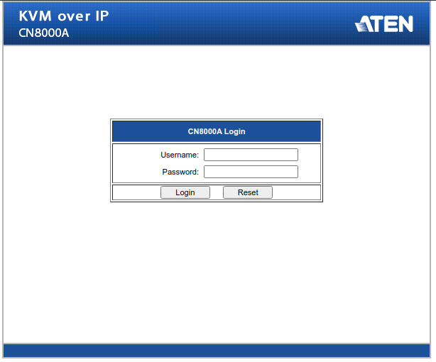

# KVM over IP CN8000A from ATEN

The instruction that helps you to run the Java Client from ATEN's software "KVM over IP" on modern workstations.

## Problem

Modern Java versions cannot run JNLP files and most instructions in the net say to run them using Java 7.

The solution is to use this article - https://blog.sebastian-daschner.com/entries/java_web_start_in_docker_sandbox - (run JNLP files in Docker with X11).

My OS is Ubuntu and in Linux/GNU distros this solution will work correctly if your OS has X11.

## Solution

0)

```
git clone https://github.com/egorsmkv/kvm-over-ip-cn8000a-jnlp-client
cd kvm-over-ip-cn8000a-jnlp-client
```

Copy your JNLP files into the `kvm-over-ip-cn8000a-jnlp-client/jnlp` folder.

1)

```
docker build -t jnlp_java7:latest .
```

2)

```
docker run -ti --rm -e DISPLAY=$DISPLAY -v /tmp/.X11-unix/:/tmp/.X11-unix/ jnlp_java7:latest /bin/bash
```

3)

```
jcontrol
```

You will get a window with Java's settings. Click "**Security**" => turn on "**Enable Java content in the browser**" and click "**Apply**", then click on "**Medium**" option in the **Secuity Level** options and click "**Apply**" again.

4) 

```
javaws -verbose jnlp/JavaClient.jnlp
```

Related issues:

- https://github.com/AdoptOpenJDK/IcedTea-Web/issues/437
